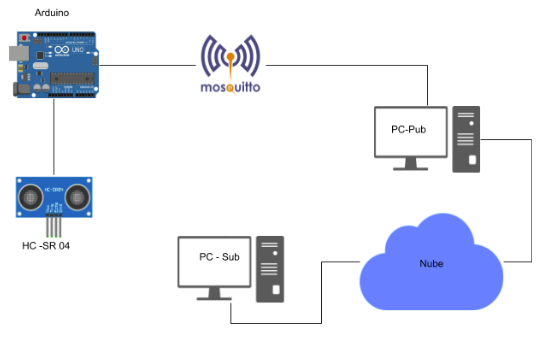

# IoT-Poject

Este pequeño proyecto desarrollado en Python y Arduino simula llevar un conteo de entradas y salidas de algún lugar mediante el uso del protocolo MQTT y el Broker Mosquitto, enviando cada entrada al host de servicio gratuito cloudmqtt.

## Arquitectura de funcionamiento

## ¿Cómo funciona?

Cada sensor de ultrasonido HC-SR04 nos permitirá capturar el movimiento simulando la entrada o salida de la persona y mediante la comunicación serial entre la placa Arduino y el ordenador es como Python tambien puede leer estos datos y enviarlos a "cloudmqtt" implementando el protolocolo MQTT y haciendo uso del broker Mosquitto.

## Librerias necesarias

Para el correcto funcionamiento del programa es necesario descargar la libreria "paho-mqtt" de Python mediante su gestor de paquetes pip o pip3.

### Para Python3.x
`pip3 install paho-mqtt`

### Para Python2.x
`pip install paho-mqtt`
